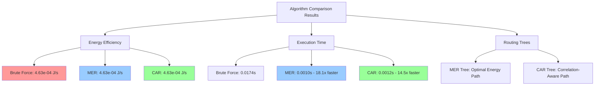
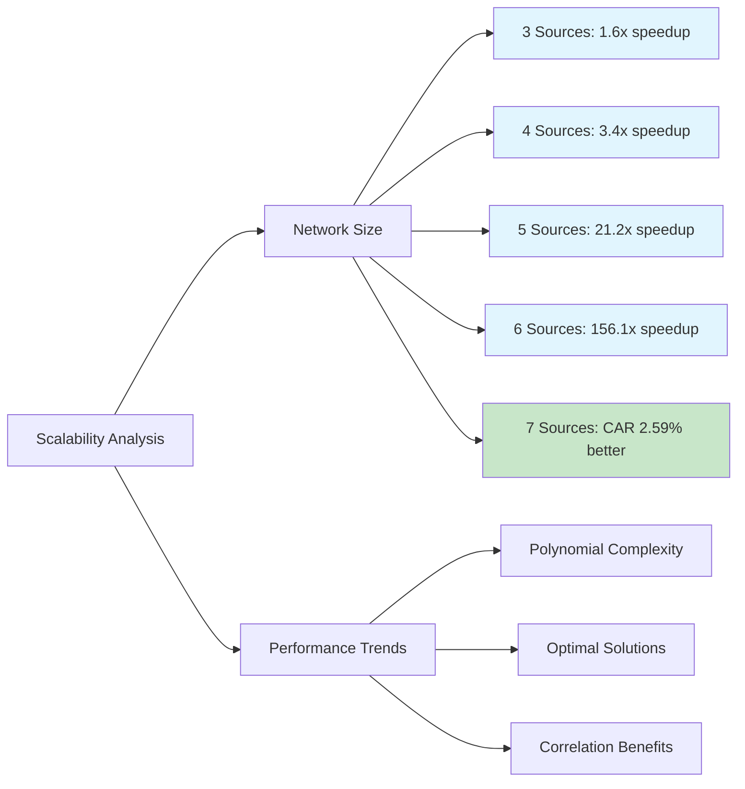
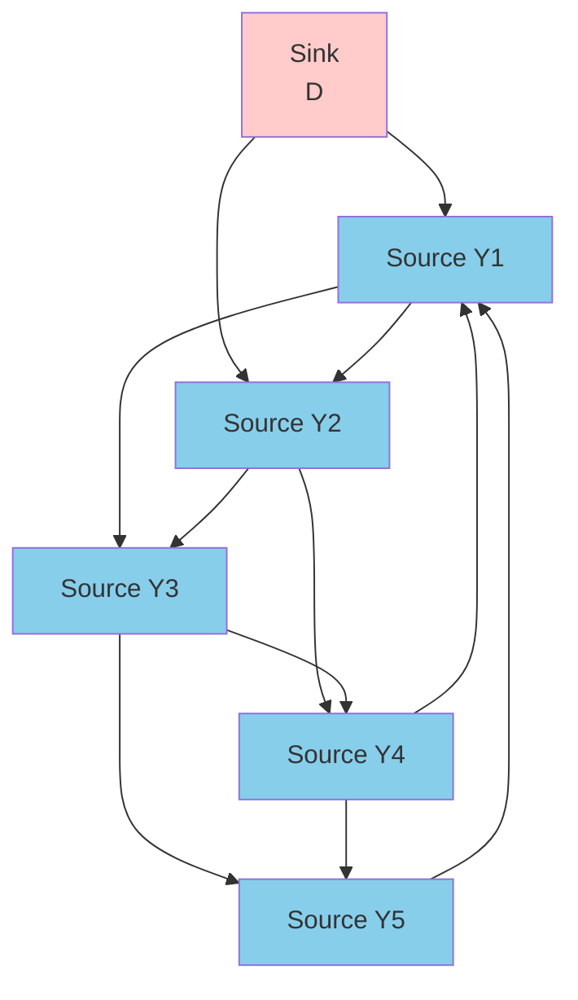

# WSN-Routing: Correlation-Aware Routing Analysis

Implementation and comparison of Wireless Sensor Network routing algorithms based on [this research paper](https://www.sciencedirect.com/science/article/abs/pii/S1570870511002320).

## 🚀 Quick Start

```bash
pip install networkx matplotlib numpy
python static_corr_routing.py
```

## 📊 Results

### Algorithm Comparison




**Key Findings:**
- **MER (Minimum Energy Routing)**: 18-156x faster than brute force
- **CAR (Correlation-Aware Routing)**: Optimal solutions with correlation modeling
- **Both algorithms achieve optimal energy efficiency** (0% gap vs brute force)

### Scalability Analysis


**Performance:**
- Excellent scalability across network sizes (3-7 sources)
- CAR shows advantages in larger networks (2.59% better than MER at 7 sources)
- Polynomial time complexity vs exponential brute force

### Network Topology


## 🏗️ Algorithms

1. **Brute Force**: Optimal but exponential complexity (≤6 sources)
2. **MER**: Game-theoretic approach minimizing total energy
3. **CAR**: Advanced algorithm considering spatial data correlations

## 📈 Network Topology

- **Pentagon Configuration**: Sources arranged around central sink 
- **Fully Connected**: All sources can communicate with each other tho two node can hop on sink
- **Visualization**: Blue nodes = sources, salmon node = sink, green arrows = optimal routes

## 🔬 Technical Details

- **Physical Layer**: Path loss model with SNR/BER calculations
- **Data Aggregation**: Sequential loss model with correlation function `q(d) = exp(-d/corr_scale)`
- **Game Theory**: Best-response dynamics for convergence to Nash equilibrium

---

**Note**: This implementation demonstrates that both MER and CAR achieve optimal solutions while providing significant computational advantages over brute force enumeration.

